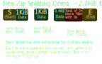

# Hex-Zip (aka HZ)
Hex-Zip is an experimental file compression program that aims to work with all types of data. It will be fast and memory-efficient, processing just 1KiB (1024 bytes) of data at a time. Its compression algorithm (explained below) is designed in such a way that it can compress already-compressed files, resulting in infinite storage space reductions at the cost of CPU time. We call this method of compression "multi-layer compression".

This program's source code is hosted here because it will be included with 3dOS. All programs that will be included with 3dOS pre-installed will be hosted in this repository in their own orphan branches.
## How it Works
This section is being used for planning the program. I already have a clear gist about how it should work in my head, this is the place to write it all down. 

### How files are split up
The input file is progressively split into 1KiB blocks, as compression moves on from block to block; so after block 1 is done being compressed, then the program looks 1025 bytes ahead of the last byte of the first block and says "OK, this is the end of the second block." Then it compresses that block, looks 1025 bytes ahead of the last byte of the second block, thinks of that point as the end of the third block, and so on. If the size of the input file in bytes is not a multiple of 1024, the "last" block is filled with zeroes. See image below or [click here](./assets/readme/hzdms1.svg) for more understanding.  

### How the compression algorithm works (how a block gets compressed)
The "File" links show what the data looks like at the completion of each step. (This data will not be written to disk in the real program; it will be retained in memory.)
1. [File](./assets/readme/stage1) | Convert the raw data of the block to hexadecimal form (AKA get a hex dump of the block). Store it in memory (it will be about 2 KiB in hex form.)
2. [File](./assets/readme/stage2) | Convert the hex-dump of the block into base-10 decimal form. Store the result in memory (~3KiB).
3. The hard part

(The above text is still being worked on. I am conducting early testing with the program.)

## Compiling
How to compile Hex-Zip for your platform. Since it is written in fairly portable C++ it should compile fine on any machine/compiler that includes C++20 and `ncursesw`.

### Windows
When setting paths, remember that **you must not add trailing slashes!** Also, `/` is preferred over `\` for consistency purposes (`\` might not work if you're compiling on a wierd filesystem).

**System Requirements:** Windows 7 x64 or newer  
**Estimated Disk Space Usage:** have a good 10GiB of space free before following the steps. Your mileage may vary, so don't freak out if your computer says there's only 8GiB free, because it might still work. If it doesn't, take 5 to delete your cat videos.

0. The most essential step, hence why I numbered it Step 0: **Install a compiler supporting C++20 and `ncursesw`.** I recommend using [MSYS2](https://www.msys2.org/). Install the mingw64 compiler from the MSYS2 Shell by running `pacman -S mingw-w64-x86_64-toolchain`. If you're using a compiler other than MSYS2/mingw64 then I assume you know what you're doing since the rest of this tutorial only covers MSYS2/mingw64.  
1. Set your `%HZ_ROOT%` environment variable to the directory where you cloned the Hex-Zip repository.  
2. Set your `%HZ_COMPILER` environment variable to the root directory of your installation of GCC. Where the `bin/`, `lib/`, and stuff like that directories are. (I'm using MSYS2, so in my case it would be `C:/some/folder/msys2/mingw64`.)  
3. Open your MSYS2 MINGW64 Shell. (Or use regular Command Prompt if you know what you're doing.)  
4. Install the package `pacman -S mingw-w64-x86_64-ncurses --noconfirm`.  
5. Run `pacman -Syuu` to update all packages. Ya'know, just making sure everything's spotless before we start compilation.  
6. Run `cd /D %HZ_ROOT%`. (`/D` ensures that the command will work just in case you cloned to a different drive. It'll still work if you do it within `C:/`.)  
7. Run `scripts/build.win64.bat`. (No, 32-bit is not supported. Download [SecureAble](https://www.grc.com/securable.htm) to make sure that you can or can't install a 64-bit version of Windows. To my surprise, SecureAble helped me find out that a dusty old Dell Vostro 260s was capable of 64-bit computing! Try it and maybe you'll get lucky.)
8. Done! Your binary is located in `%HZ_ROOT%/bin`. Make sure to copy the *entire* folder when you redistribute your freshly compiled copy or there may be legal trouble.