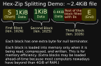

# Hex-Zip (aka HZ)
Hex-Zip is an experimental file compression program.

## How it Works
This section is being used for planning the program. I already have a clear gist about how it should work in my head, this is the place to write it all down.
1. Input file is split into 1KB blocks. If the size of the input file in bytes is not a multiple of 1024, the "last" block is filled with zeroes. See image below or [click here](./assets/readme/hzdms1.svg) for more understanding.
